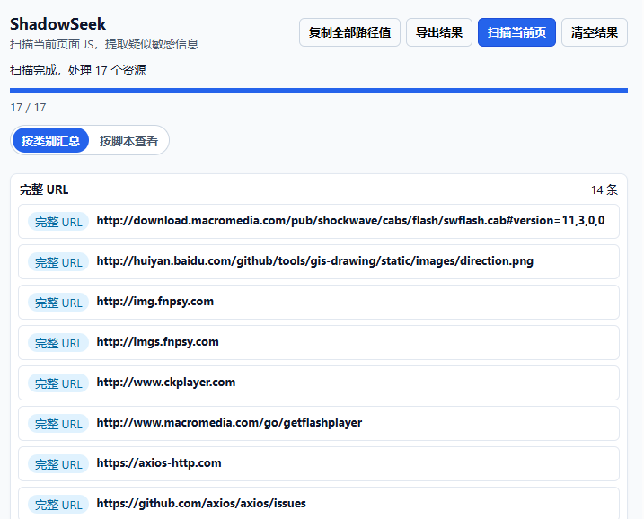
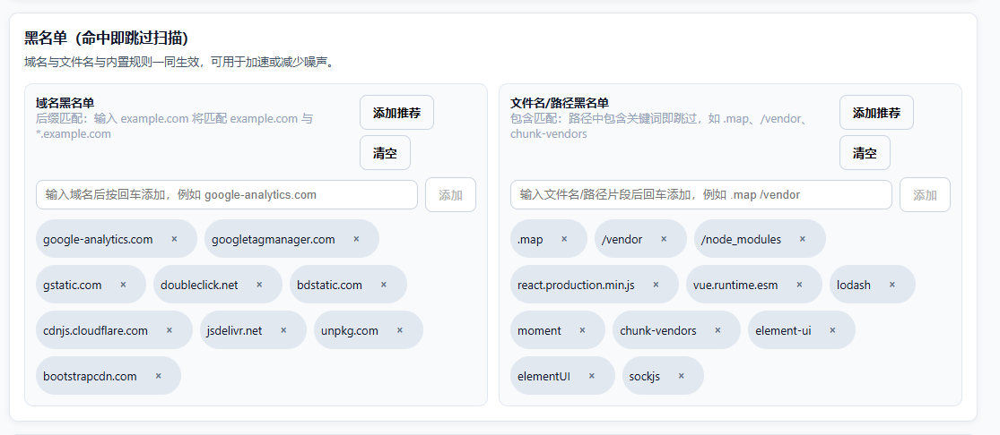

# ShadowSeek JS Scanner

在浏览器中扫描当前页面相关资源（脚本 + 页面 HTML + 可读 iframe HTML + DOM 中 href/src 目标等），基于可配置正则规则提取疑似敏感信息并保存在 IndexedDB，可视化结果、进度与规则管理。

## 功能特性
- 一键扫描当前标签页，实时显示进度、当前脚本、扫描结果数量。
- 覆盖内联脚本、DOM 中的 `<script>`、performance 记录的动态 chunk、preload/modulepreload 资源；并扩展扫描页面 HTML、同源 iframe HTML、DOM 中 href/src 目标（用于更全面地提取路径/URL 等线索）。
- 内置多条常用规则（API Key、云凭据、JWT、硬编码密码、数据库连接串、接口/GraphQL/WebSocket、SourceMap 等），并包含 find 风格的 URL/路径/IP 规则，支持启用/禁用、编辑、新增。
- 规则导入/导出 JSON，便于团队共享；支持正则 flags 校验与错误提示。
- 结果默认按类别汇总展示（完整 URL / 路径等会分别汇总、去重、排序），并可切换到“按脚本查看”；支持按当前域名过滤；支持清空全部或按域名清空。
- 接口/域名结果区分“完整 URL”与“路径”，一键复制当前筛选下的全部接口/路径（自动去重、排序、去掉首尾引号），支持导出结果 JSON（含汇总 groups + 明细 items）。
- 黑名单：域名与文件名黑名单（含预设），标签式管理、可一键添加推荐或清空，命中即跳过以减少噪声、提升速度。
- 输出黑名单：命中即忽略结果（不保存/不展示），支持 glob（`*`）匹配，且在扫描阶段就过滤，避免占用产出上限。
- 可配置：是否包含内联脚本、最大单文件体积、请求/正则扫描超时（当前版本默认关闭超时限制以便尽量扫全）、页面加载完成后自动扫描。

## 安装
使用已构建好的扩展包，无需本地构建：
1) 下载发布的打包文件并解压，确保其中包含 `manifest.json`（通常位于 `dist/`）。
2) Chrome/Edge：打开 `chrome://extensions` 或 `edge://extensions`，开启“开发者模式”，选择“加载已解压的扩展程序”，指向解压后的目录。

## 快速使用

1) 打开目标页面，点击工具栏图标唤起弹窗。
2) 点击“扫描当前页”，等待进度条完成；过程中可看到当前处理的脚本与增量结果。
3) 默认按类别汇总展示（完整 URL / 路径等会分别汇总），也可以切换到“按脚本查看”；接口类会标注“完整 URL/路径”，其他按类型标签（API Key/凭据/云/接口/PII/配置/数据库/漏洞/信息）。
4) 点击“复制全部路径值”可一次性复制当前筛选下的所有接口 URL/路径（去重）。
5) 点击“导出结果”可下载当前结果（JSON）。
6) 黑名单（选项页）：标签式添加/删除域名与文件路径片段，可一键添加推荐列表或清空。
7) 点击“清空结果”可清理当前域或全部记录。

## 配置与规则管理

- 设置入口：扩展选项页。
- 扫描设置：
  - `包含内联脚本`：抓取 `<script>` 内联内容。
  - `自动扫描新标签页`：页面加载完成后自动触发。
  - `单文件最大体积 (MB)`：超出则跳过。
  - `请求超时 (ms)`：拉取远程资源的超时时间（当启用超时限制时生效）。
  - `正则分析超时 (ms)`：单资源正则扫描的安全时限（当启用超时限制时生效）。
- 输出黑名单：
  - `输出黑名单`：命中即忽略结果（不保存/不展示），支持 glob（`*`）匹配（如 `http://www.w3.org/*`、`text/*`、`./*.svg`）。
- 规则管理：
  - 新增/编辑/删除/启用/禁用规则；正则会在保存前校验。
  - 导入：上传 JSON（数组或 `{ rules: [] }` 结构，字段含 `id/name/category/severity/pattern/flags/enabled`）。
  - 导出：下载当前规则为 `shadowseek-rules.json`。
  - 默认规则示例：GitHub/Google/AWS/阿里云/腾讯云密钥、JWT、硬编码密码、邮箱/手机号/身份证、数据库/ JDBC URL、API/GraphQL/REST/WebSocket、SourceMap，以及 find 风格的 URL/路径/IP 规则等。

## 数据与权限
- 数据存储：扫描结果与脚本摘要保存在浏览器 IndexedDB（`shadowseek-db`），可在弹窗或设置页清空。
- 权限：`scripting`、`storage`、`activeTab`、`tabs` 与通配的 `http/https` 站点权限，用于注入内容脚本、读取/写入设置和扫描结果、访问当前标签页并抓取脚本。
- 跳过策略：默认忽略常见第三方库与 `.map` 文件（如 node_modules、CDN、大型通用库）以减少噪声。

## 工作原理（简述）
1) 内容脚本收集：脚本 URL/内联内容、performance 资源、preload/modulepreload；并收集页面 HTML、同源 iframe HTML、DOM 中 href/src 目标；同时捕获可能的接口访问端点。
2) 后台按规则拉取与扫描（带体积限制；同源请求会尽量贴近页面实际加载），执行正则扫描并截取上下文；输出黑名单会在扫描阶段过滤以避免占用产出上限。
3) 结果写入 IndexedDB，并通过消息推送进度/完成事件；扫描进度状态按 URL 持久化，弹窗可恢复显示并实时刷新。

## 已知限制与建议
- 正则匹配可能产生误报，建议结合上下文人工确认。
- 扩展扫描范围与放宽产出上限后，结果可能显著增多；建议优先使用输出黑名单与规则管理来降噪。
- 自动扫描需页面加载完成才触发；若站点阻止内容脚本或跨域资源不可访问（CORS），可能出现“未获取到可扫描内容”的提示。

